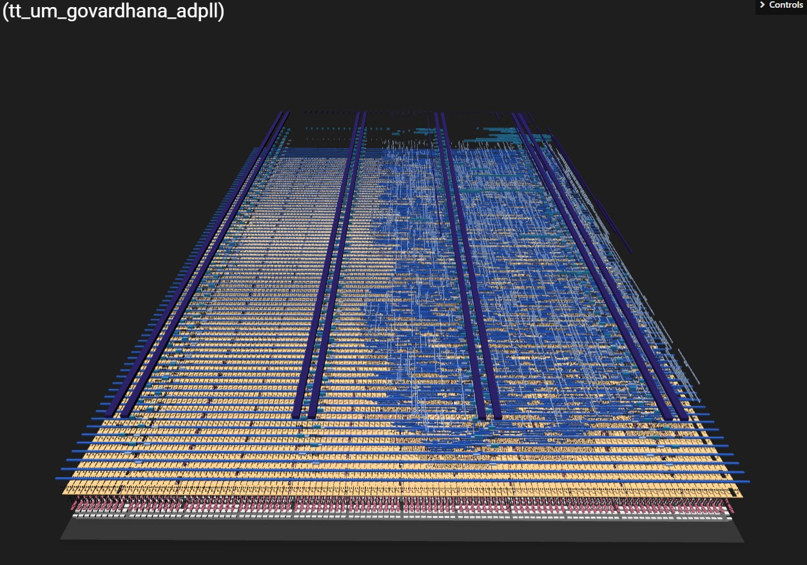
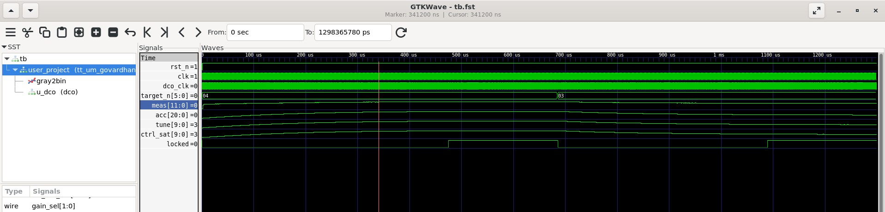

# All-Digital PLL Clock Generator

[](https://github.com/SriKondapaturi/tt-um-govardhana-adpll/actions)
[](https://github.com/SriKondapaturi/tt-um-govardhana-adpll/actions)
[](https://github.com/SriKondapaturi/tt-um-govardhana-adpll/actions)

A two-tile all-digital PLL fabricated on the Tiny Tapeout SKY 26c shuttle (SkyWater 130 nm). It multiplies the 10 MHz board clock up to a programmable output frequency, 40 MHz by default, using a ring-oscillator DCO built entirely from standard cells. There is no analog circuitry anywhere in the loop: phase detection is done by counting, the loop filter is a small PI accumulator, and the oscillator is tuned by switching taps along an inverter chain.

**Layout:** [3D viewer and project page](https://srikondapaturi.github.io/tt-um-govardhana-adpll/)

## At a Glance

| Metric | Value |
|---|---|
| Process | SkyWater SKY130 (open PDK) |
| Shuttle | TinyTapeout SKY26c |
| Tile size | 1x2 (two-tile submission) |
| Standard cells | 941 (31.7% utilization) |
| Routed wire | 18.7 mm |
| Flip-flops | 142 |
| Reference frequency | 10 MHz |
| Output frequency | Programmable, 39.81 MHz at default N=4 |
| Lock time | ~650 us at default gains |
| DRC / LVS / ANTENNA | Clean (Magic + KLayout precheck) |
| Silicon return | Expected May 2027 |

## Architecture

```
                    +----------+     +-----------+     +----------+     +-----+
    REF (10 MHz) -->|   TDC    |---->| PI Loop   |---->| Tuning   |---->| DCO |----> OUT
                    | (counter |     | Filter    |     | Word     |     |Ring |
                    |  + sync) |     | (I + P)   |     | Decoder  |     |     |
                    +----------+     +-----------+     +----------+     +--+--+
                          ^                                                |
                          |                                                |
                          +--- Gray-counter feedback (2-stage sync) -------+

                                +-----------------+
    N[5:0], Gain[1:0] --------->| Live Control    |----> Lock Flag
                                | (retune w/o rst)|----> DCO/2, Tune Debug
                                +-----------------+
```

## How it works

The DCO free-runs at a frequency set by its 10-bit tuning word. A Gray-coded counter in the DCO clock domain counts oscillator cycles; the count crosses into the reference domain through a two-stage synchronizer and is sampled once every 16 reference cycles. The difference between consecutive samples is the measured cycle count for that window, and comparing it against N * 16 gives a signed frequency error. This is a counter-based time-to-digital converter with a resolution of one DCO cycle per window (625 kHz at the 10 MHz reference).

A PI filter integrates the error into the tuning word. The coarse bits of the word select one of 16 taps along the ring, so the oscillator tunes in discrete steps and dithers between adjacent taps once settled; the integrator averages this dither into the intended mean frequency. Because of the dither, the lock detector does not judge single windows. It accumulates the error over groups of four windows and asserts lock only after eight consecutive groups land within two counts of target.

The target multiplier N is applied live from the input pins, so the loop can be retuned at any time without reset. Two further pins select one of four PI gain presets, trading lock speed against settling behaviour.

## Pinout

| Pin | Function |
|---|---|
| ui_in[5:0] | Target multiplier N, 1 to 63. Zero selects the default N = 4 |
| ui_in[7:6] | Loop gain preset: 00 default, 01 fast, 10 slow, 11 aggressive |
| uo_out[0] | DCO clock divided by 2 |
| uo_out[1] | Lock flag |
| uo_out[7:2] | Upper bits of the DCO tuning word, for debug |

## Hardening results (TTSKY26C flow)

941 standard cells excluding fill and tap, 31.7 % utilisation of the 1x2 tile, 18.7 mm of routed wire, 142 flip-flops. Magic DRC and the full KLayout precheck suite pass clean.

The linter reports 26 warnings about unclocked register pins. These are the registers in the DCO clock domain: dco_clk is generated on-die by the ring, so the lint step has no way to recognise it as a clock. The warnings are expected for this architecture and carry no action.

## Verification

The testbench is cocotb driving Icarus Verilog, with a behavioural DCO model whose period is a linear function of the tuning word. The closed loop locks at 39.81 MHz for N = 4 and retunes to 30.39 MHz for N = 3, with a lock time of about 650 us at the default gains. The same test passes locally and in CI.

```
cd test
pip install -r requirements.txt
make -B
```

There is deliberately no gate-level simulation. The free-running ring forms a zero-delay loop in the PDK functional models under Icarus, which freezes simulation time and makes any GL run hang regardless of the testbench. Netlist-level confidence comes from DRC, LVS and the precheck suite instead, and loop behaviour is covered at RTL.

## Screenshots

### Final GDSII Layout


### Lock waveform (cocotb, N=4)



## Notes for silicon bring-up

The ring frequency will shift with process, voltage and temperature, so the usable N range on real silicon will differ from the behavioural model. The programmable multiplier and the tuning-word debug pins exist for exactly this reason: sweep N, watch uo_out[0] on a counter and uo_out[7:2] on a logic analyser, and the DCO transfer curve falls out directly. Chips are expected back around May 2027.

## Author

**Govardhana (Sai) Kondapaturi**
MS ECE, California State University, Fresno (August 2026)
Advised by Prof. Aaron Stillmaker

- LinkedIn: [sri-kondapaturi](https://www.linkedin.com/in/sri-kondapaturi/)
- GitHub: [SriKondapaturi](https://github.com/SriKondapaturi)
- Email: srigovardhan96@gmail.com

Submitted as part of my graduate work at CSU Fresno. First silicon tapeout.

## Acknowledgements

- Matt Venn and the [TinyTapeout](https://tinytapeout.com/) team for making foundry access this approachable
- The SkyWater and Efabless teams for the open [SKY130 PDK](https://github.com/google/skywater-pdk)
- The [OpenLane](https://github.com/The-OpenROAD-Project/OpenLane) and [OpenROAD](https://theopenroadproject.org/) communities

## License

Apache-2.0
